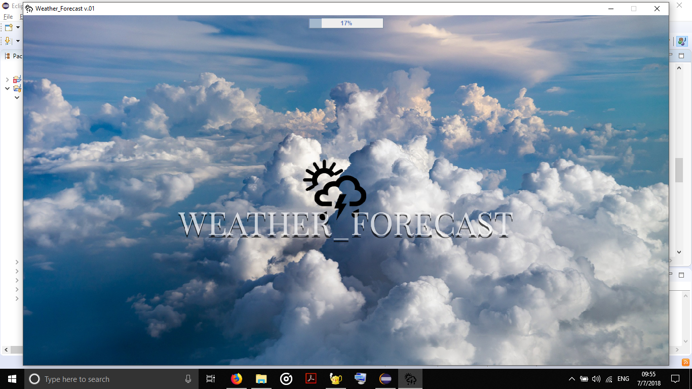
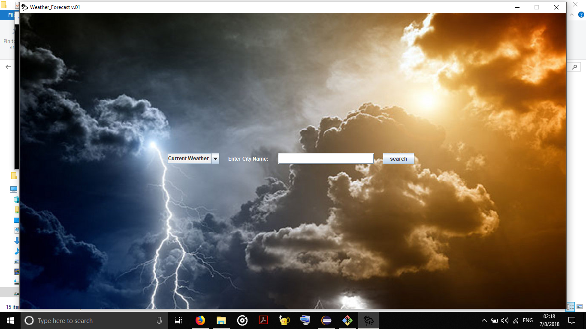
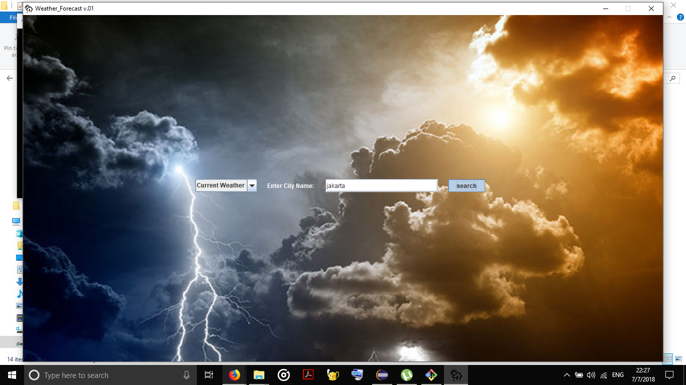
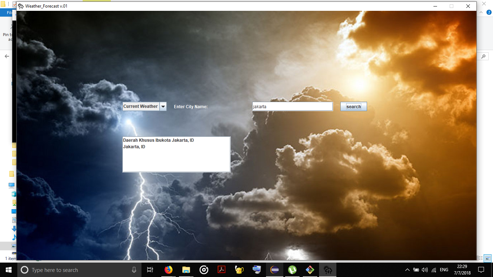
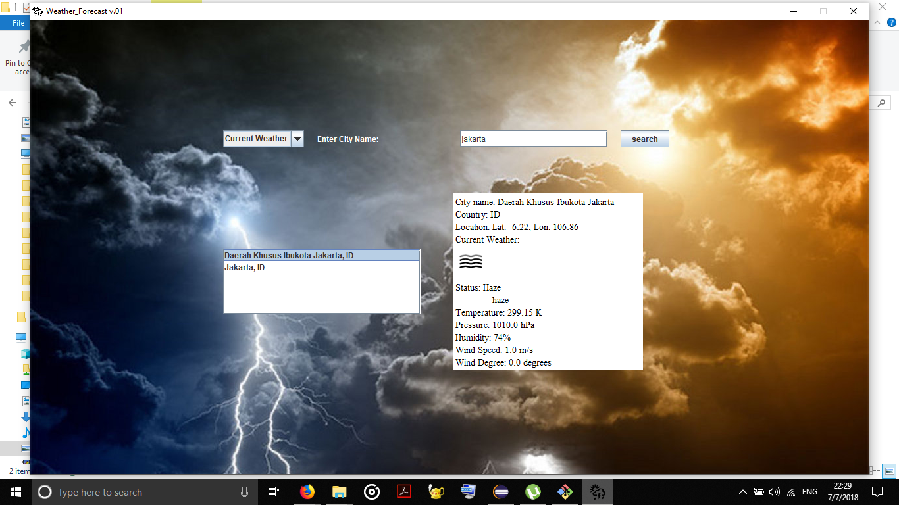

# Weather_Forecast v.01
A weather forecast application using Java Swing and Open Weather Map API

## What is API
In computer programming, an application programming interface (API) is a set of subroutine definitions, protocols, and tools for building application software. In general terms, it is a set of clearly defined methods of communication between various software components. Application programming interfaces make it easier for developers to use certain technologies in building applications. By abstracting the underlying implementation and only exposing objects or actions the developer needs, an API simplifies programming.

In this software, the developer uses an API called `Open Weather Map`. This API is used to access informations about cities' current weather data, and/or daily forecasts.

## Packages
- API : Classes containing methods to request data from `Open Weather Map`.
- DATA : Classes containing data received from API.
- GUI : Classes containing methods to show data based on user's input, displaying city's weather information, graphic icons, search list and such.
- JUNIT : For internal testing of classes in other packages.

## Features
- [x] Search for a city/list of cities
- [x] Show the search result
- [x] Show city's weather forecast
- [x] Show more detailed informations of the forecast, such as temperature, wind speed, clouds.

## How to compile/run
Compile : Execute make.sh
Run : Execute run.sh

## How to use
1. Run the program
2. Wait for it to complete loading files

3. Search current weather/forecast of a city by entering the city's name in the given form

4. Click the search button to show the result(s)*

5. Wait for a few seconds for the program to fetch and display the result(s)*

6. Click the resulting city's name to view its forecast descriptions**

*The application will show cities which names contain input (as a substring) from the form
**Forecasts displayed are within the next 3 days, every 6 hours

## Updates
- 14 June 2018 : added structural explanation to README
- 27 June 2018 : added external libraries and sample program, implemented CityWeather and CityForecast class, created City and Weather class.
- 4 July 2018 : added GUI implementations(app cover and search page), GUI classes for app panels.
- 5 July 2018 : added unformatted search bar and raw search results.
- 6 July 2018 : added JUnit for testing, run.sh and make.sh for running, and compiling the program respectively.
- 7 July 2018 : fixed bugs on the search page, formatted search results.
- 8 July 2018 : added Javadoc comments and JDepend analysis.
